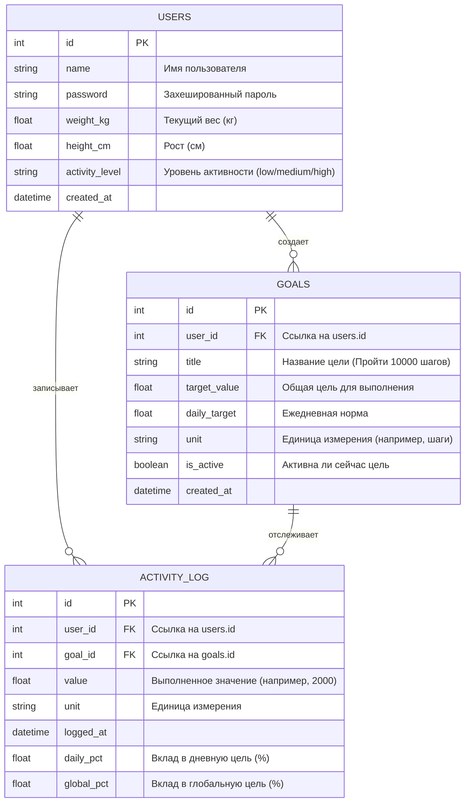

# Структура базы данных (ER Диаграмма)

Диаграмма сущностей и связей для платформы "Step by Step".

```mermaid
erDiagram
    USERS ||--o{ GOALS : "создает"
    USERS ||--o{ ACTIVITY_LOG : "записывает"
    GOALS ||--o{ ACTIVITY_LOG : "отслеживает"

    USERS {
        int id PK
        string name "Имя пользователя"
        string password "Захешированный пароль"
        float weight_kg "Текущий вес (кг)"
        float height_cm "Рост (см)"
        string activity_level "Уровень активности (low/medium/high)"
        datetime created_at
    }

    GOALS {
        int id PK
        int user_id FK "Ссылка на users.id"
        string title "Название цели (Пройти 10000 шагов)"
        float target_value "Общая цель для выполнения"
        float daily_target "Ежедневная норма"
        string unit "Единица измерения (например, шаги)"
        boolean is_active "Активна ли сейчас цель"
        datetime created_at
    }

    ACTIVITY_LOG {
        int id PK
        int user_id FK "Ссылка на users.id"
        int goal_id FK "Ссылка на goals.id"
        float value "Выполненное значение (например, 2000)"
        string unit "Единица измерения"
        datetime logged_at
        float daily_pct "Вклад в дневную цель (%)"
        float global_pct "Вклад в глобальную цель (%)"
    }
```
